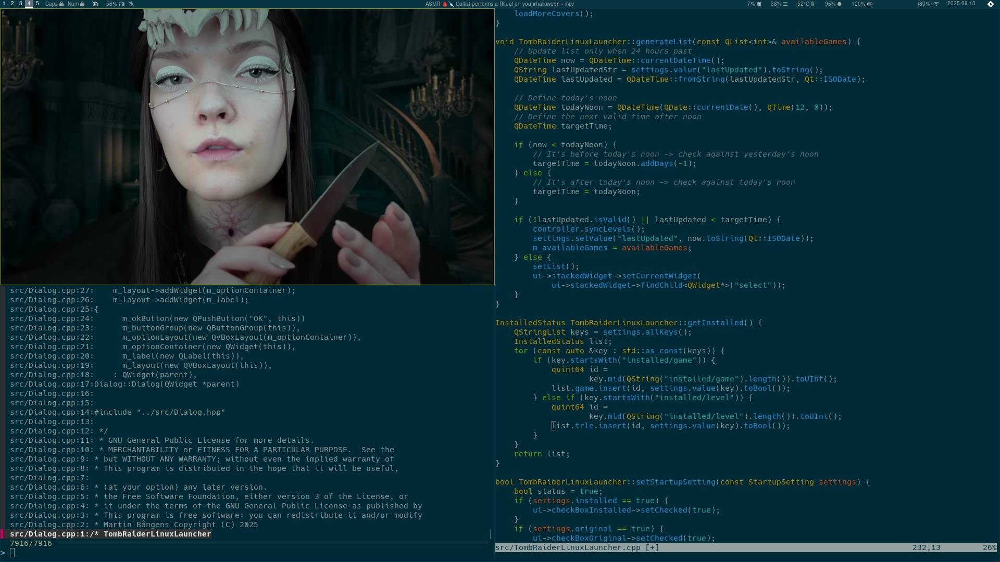

# Code

## Style

## Testing

## Target

I program mostly on Slackware-current and Arch, I gonna try target and test
SteamOS for second release. I don't use Windows but it should build on both
Windows and Linux with MinGw. It's recommended as a standard to use Arch Linux
or MSYS2 on Windows, with qt-creator. I use neovim and qt-creator at the same
time.

You can have qt-creator open and configured to build in build/Desktop-Debug
while you have neovim using the build directory. I find qt-creator useful for
its debugger.

