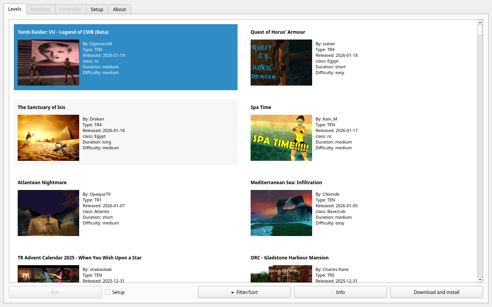
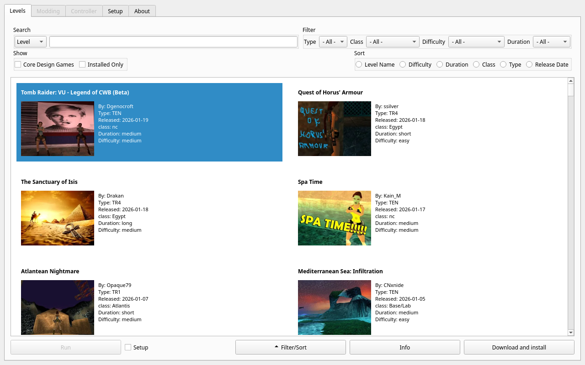
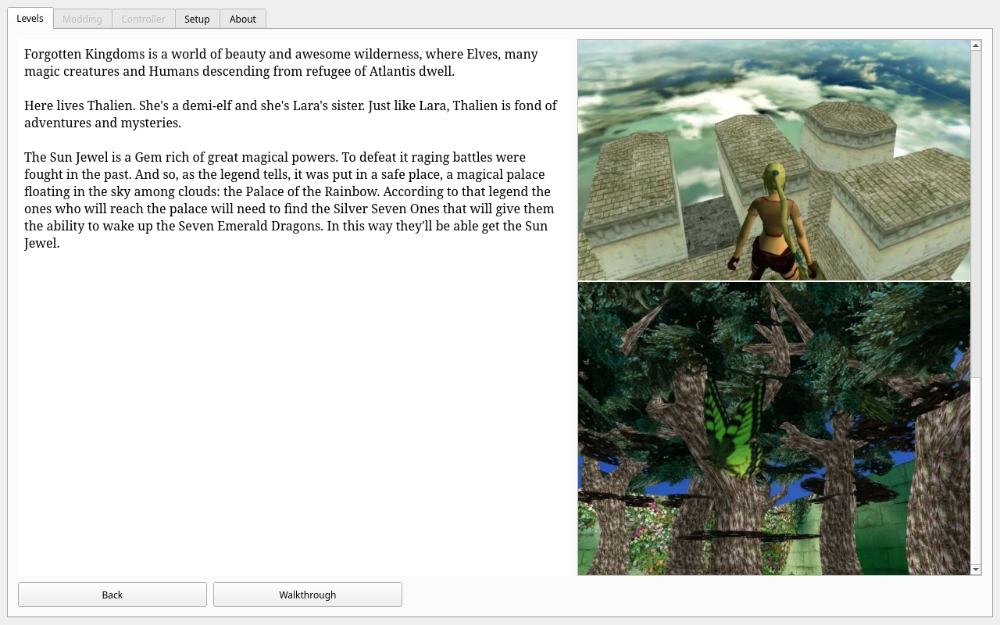
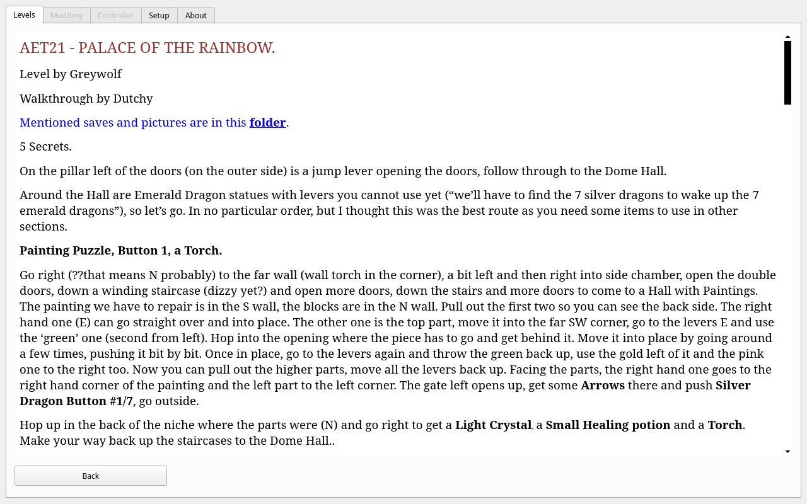
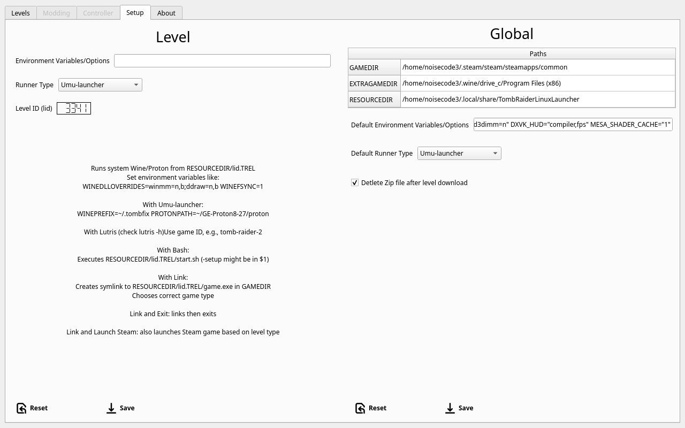

# Guide

This guide is meant to contain everything about the app and how to run the game.
It's a work in progress, the info and default keyboard shortcuts might change,
get reimplemented. Setup tab should change to a scroll down page at some point.

I'm implementing some keyboard shortcuts, the marked once are done.
Those can easily be changed in code also later in the app.

## List View

The List View is the main page of the application and where you will spend
most of your time. It shows all available levels synced daily by comparing the
first page of trle.net with your locally cached records.

When a level is being downloaded, the level entry switches to a progress bar
and the List View is temporarily disabled to prevent conflicting actions.

By default, umu-run is selected as the runner. For first-time use, it is
recommended to open Setup and configure the runner before launching a level.
Make sure that umu-launcher or wine is installed on your system.

From here you can:

- Browse levels with cover image and metadata
- Quickly search, filter, and sort the list
- Open detailed information for a level
- Download and unpack new levels
- Launch an unpacked level directly

- [x] Run Level (enter)
- [x] Setup Level (ctrl+u)
- [x] Setup Tab (alt+u)
- [x] Filter Show/Hide (ctrl+f)
- [x] Info (ctrl+i)
- [x] Download (ctrl+d)

## Filter

- [x] Focus Search (ctrl+s)
- [x] Focus Select Level (ctrl+l)
- [x] Search Type select (ctrl+t)
- [ ] Core Design (ctrl+o)
- [x] Installed Only (ctrl+n)
- [x] Focus Filter Menu (ctrl+y)
- [x] Focus Sort (ctrl+r)

## Info

- [x] Focus Info content (ctrl+i)
- [x] Focus Cover List (ctrl+c)
- [x] Go to Walkthrough (ctrl+w)
- [x] Go Back to Level List (ctrl+b)

## Walkthrough

- [x] Go Back To Level List (ctrl+b)

## Setup

- [x] Level Tab (alt+l)
- [x] Save Level Options (ctrl+s)
- [x] Reset Level Options (ctrl+r)
- [x] Environment Variables (ctrl+e)

## Some open source modes that work well with Proton/Wine

- TR1 <https://github.com/LostArtefacts/TRX>
- TR2 <https://github.com/Arsunt/TR2Main>
- TR3 <https://github.com/Trxyebeep/tomb3>
- TR4 <https://github.com/Trxyebeep/TOMB4>
- TR5 <https://github.com/Trxyebeep/TOMB5>
