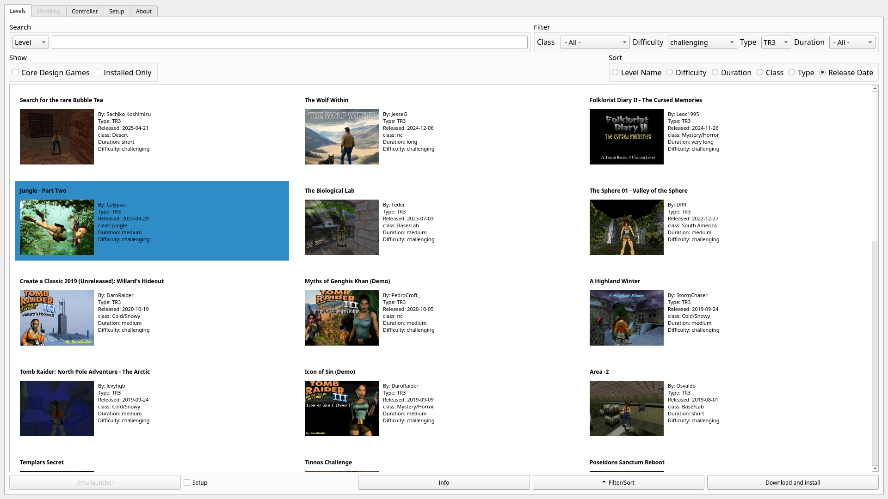

# Tomb Raider Level Launcher

Tomb Raider Level Launcher is a tool for playing and modding classic
Tomb Raider games (1–5) on Linux using Wine/Proton, with Windows support planned
later.

It lets you search, download, and play custom levels from trle.net directly
from the launcher.

Note: This repository will be renamed/moved to TombRaiderLevelLauncher.

<!-- markdownlint-disable MD033 -->

  

<!-- markdownlint-enable MD033 -->

## Features

- [x] Run level with Wine/Proton from app
- [x] Search trle.net with fast offline indexing
- [x] Lazy loading trle.net level info (runtime scraping)
- [x] Integrates with Linux other launchers (Steam, Lutris, etc.)
- [ ] Detect and modify Core Design games
- [x] Level download from trle.net
- [ ] Level download trcustoms.org
- [ ] Controller mapper support using uinput
- [ ] Game save and configuration file backups
- [ ] Workarounds for compatibility issues (custom dlls)
- [ ] Download and applying open source modes to some TRLE
- [ ] Modify binary files (widescreen patches)
- [ ] Pool level files to save disk space, need NTFS on Windows for hard links

## Pages

[Install](INSTALL.md)

[Manual](MANUAL.md)

[Code](CODE.md)

[Roadmap](ROADMAP.md)

## License

This project is licensed under GPLv3. Art assets are under
Creative Commons Attribution-NonCommercial-ShareAlike 4.0.
Tomb Raider is a trademark of Embracer Group AB.
